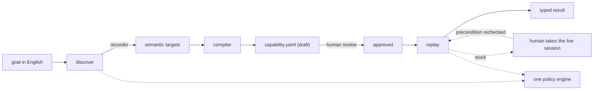

# Design write-up

## 1. Architecture

A bank has an internal application with no API. A model drives it once and works out how to do a
task. What it learned is saved as a capability. After that the task runs with no model involved.



Three boundaries carry the design:

- **`DiscoveryModel`** — the discovery loop never imports the Anthropic SDK. The import is lazy,
  inside the one class that calls the API, so replay cannot reach a model even by mistake. The suite
  runs with the API key removed from the environment to prove it.
- **`SurfaceAdapter`** — find, read, navigate, screenshot. Nothing above it knows Playwright exists.
- **`authorize()`** — discovery and replay call the same policy engine. The model proposes. It never
  executes.

One process, no queues. The problems worth showing are contract design and failure handling, and
neither needs infrastructure.

I built the target application rather than using a public demo site. Meridian CU has no test IDs, no
element ids, a table layout, and a real iframe. Clean selectors would have made the locator problem
disappear, and the locator problem is most of the job.

## 2. Artifact schema

`schema/artifact.py` is the source of truth. The YAML and the generated JSON Schema are projections
of it, and every model forbids unknown fields, so a malformed artifact is rejected at the boundary
rather than halfway through a run.

```yaml
capability:      id, version, description
approval_state:  draft | approved
application:     family, supported_versions, fingerprint
inputs:          typed, with patterns and a sensitive flag
outputs:         typed, each pinned to the step where it is visible
interstitials:   screens the capability is allowed to dismiss
reconciliation:  how to check whether a write landed, without repeating it
steps:           precondition, action, target, postcondition, retry, risk
provenance:      which run produced this, which model, which operator
```

`approval_state` is enforced, not documentary. It defaults to `draft`, discovery can only ever emit a
draft, and replay refuses an unapproved artifact before its first action. Promoting one is still a
hand edit. That is a gap in the tooling around the gate, not in the gate itself.

Four decisions matter more than the rest.

1. **Every step declares how it is allowed to end.** `postcondition.any_of` lists the outcomes and
   marks each as success, business outcome, or escalation. Anything not on the list is a system
   failure by definition. That one rule stops the executor having opinions about what a screen means.
2. **Targets are ranked lists, not selectors.** Each strategy is an accessible role and name, exact
   text, or "the control in the row labelled X", and replay takes the first matching exactly one
   element. "Open Sub-Account" matches every account row; "Open Sub-Account in the Savings row"
   matches one. Uniqueness is typed as always-true, so a capability cannot opt out.
3. **Outputs are pinned to a step**, so extraction happens on the screen where the value is visible.
   A value that cannot be extracted there fails rather than coming back as a missing key.
4. **Risk and retry are validated together.** A consequential write must require confirmation, be
   single-attempt, be marked unsafe to repeat, and declare how to reconcile itself. An ambiguous
   write you cannot check can only ever escalate, so the schema refuses to let you ship one.

The artifacts are verbose on purpose: a reviewer should be able to read every way a capability can
end without opening any Python.

## 3. Determinism & error handling

Replay is deterministic in three ways. No model is constructed anywhere on the path. Targeting
refuses ambiguity, so a strategy matching two elements is recorded and skipped rather than resolved
by picking one. And nothing waits on a duration: every wait re-evaluates a declared condition until
it holds or a deadline passes.

The failures that matter are not layout drift. Each has a seeded case, and every row below is a
command in the README:

| Class | Trigger | Result | Exit |
|---|---|---|---|
| Business outcome | member not found (`99999`) | `MEMBER_NOT_FOUND` | 0 |
| Business outcome | restricted record (`55501`) | `MEMBER_RESTRICTED` | 0 |
| Business outcome | negative opening deposit | `DEPOSIT_INVALID` | 0 |
| Recoverable | maintenance modal (`55504`) | declared interstitial dismissed, run continues | 0 |
| Recoverable | six-second page load (`55502`) | absorbed by a bounded wait | 0 |
| Ambiguous write | 500 after the write landed (`55505`) | probe finds it, `success` with `reconciled: true` | 0 |
| Escalation | session expired (`55503`) | `needs_human` | 2 |
| Escalation | write ambiguous, probe also failed | `RECONCILIATION_INCONCLUSIVE` | 2 |
| Hard failure | an undeclared refusal (`55506`) | `postcondition_failed` | 1 |
| Refused to start | deposit is not a number | `precondition_failed`, no browser opened | 1 |
| Refused to start | goal asks for an SSN | `policy_denied`, no artifact written | 1 |
| Refused to start | app not running, wrong product family, or artifact still draft | `validation_required`, naming the check that failed | 4 |

A declared business outcome exits 0, because the capability answered the question it was asked. Only
states needing a person are non-zero, and the code says which kind of person: 2 wants an operator on
the live session, 4 wants an author to fix the artifact or the environment.

The bottom three rows are the ones I would point at first. They are refusals that happen before the
browser opens, which is the cheapest place to fail and the easiest to leave out. A capability that
will not start is worth more than one that starts and then discovers it is on the wrong screen.

Members 55501 and 55506 both stop on a "Permission denied" panel. The screens differ by one
sentence, both return 403, and neither contains a machine-readable code. One is a legitimate fact
about the member; the other is a defect in our own entitlements. Replay separates them because the
capability declared one and not the other, and nothing in the engine reads the page to decide:

```bash
grep -rn "MEMBER_\|SESSION_\|AUTHORIZATION_" src/     # returns nothing
```

The same reasoning deleted a failure category. An earlier version had `authorization_denied`, but
for the executor to use it, the executor would have to decide that a particular refusal was about
entitlements — and the only way to know that is to read the application's wording, which is the
thing 55506 exists to forbid. So the category is gone. An undeclared refusal comes back as
`postcondition_failed` carrying the text that was on screen and the branches the capability did
declare. An operator reading that has what they need to recognise the case, name it, and add it as a
declared branch. The taxonomy grows by editing artifacts, not by editing the engine.

**Retries are deliberately narrow.** A step repeats only if its author asserted that repeating it is
safe. Otherwise it runs once, whatever the attempt count says.

That leaves one hard case: a write that may or may not have landed. Member `55505` seeds it — the
sub-account is created, and *then* the server returns 500. The click already succeeded, so pressing
it again is the one thing that must not happen. Instead replay navigates to an independent
read-only route the artifact declared, and looks:

| What the probe finds | Result |
|---|---|
| the record is there | `success`, flagged `reconciled: true` |
| the record is absent | `failure`, marked retryable — the write really did not happen |
| the probe itself failed | `needs_human` — three answers, and "I could not tell" is one of them |

What decides this is the step's risk level, not the screen. On any other step, a postcondition that
matches nothing is a flat `postcondition_failed` — the 55506 path above. On a consequential write the
same screen means something weaker and more dangerous: not "this failed" but "I do not know whether
this happened."

The test for 55505 checks that one record exists, and then checks the assertion that actually bites:
no `STEP_RETRIED` event was emitted at all. The record count on its own would prove nothing here,
because this demo app happens to deduplicate identical payloads, so it would read `1` even if replay
had clicked twice. Asserting on the event log rather than the side effect is what makes the test
sensitive to the behaviour it names.

**Drift is checked before any of that.** At startup, replay confirms the current URL matches a route
the capability was authored against and that the declared landmarks are on screen. A mismatch stops
the run before the first action rather than half-executing against a screen it does not recognise.
That is the `validation_required` row in the table above.

## 4. Heterogeneity & multi-tenant

The artifact never names a technology. Open one and the vocabulary is `role`, accessible `name`,
`same_row`, `following_cell`, `frame` — the accessibility vocabulary, because it is the one
representation shared by modern web, legacy web, and desktop. Only the adapter knows how any of it
resolves, so a legacy application of framesets and nested tables changes nothing above the adapter.
That is what the demo target already simulates.

A desktop application would need a new adapter over the platform accessibility tree. One thing there
genuinely does not port: a desktop app has no URL. That is why `Condition` is a union of four
variants — page, route, element state, and text — rather than a route matcher with extras. Only the
route variant is web-only, and no capability is obliged to use it.

For many institutions on the same vendor product, a capability is authored against the product and
never against a tenant. There is deliberately no tenant identifier in the code, because making
tenancy a first-class field is what produces hundreds of near-identical artifacts. What exists is
the compatibility check: product family, supported versions, and a fingerprint of the entry screen,
all verified before the first action.

The reuse layer itself is not built. The shape I would give it is a per-tenant override that
appends strategies to a step's existing list rather than copying the artifact, because the ladder
already takes the first unique match and the log already records which strategy fired. Drift would
then be measurable instead of anecdotal.

## 5. Escalation & handoff

A run escalates for two reasons only: the capability declared an outcome as an escalation, or policy
required a human before a risky action. Both are decided in advance. "The system got confused" is
not an escalation path.

The control transfer is the part I made real. A session lease is a small state machine (automation
active, pause requested, paused, human control, released, revalidating) and every action touching
the browser checks who holds it. Exactly one controller owns the session at a time.

The human drives the same browser window the automation was using, with the same cookies and
session. No co-browsing, no remote desktop. Their actions are captured by role and accessible name,
and values are masked inside the page before crossing into our process, so a typed member id arrives
as `***8431` and the raw value never exists in our memory.

Clicking Resume is not authority to continue. The resumed step re-verifies its own precondition
first, so if the operator left the browser somewhere the capability cannot continue from, the run
stops again rather than proceeding from a step number that no longer means anything.

The operator console is a mock: two buttons and enough context to decide. The real thing is a
browser in our infrastructure streamed to an operator working a queue. I mocked the interface and
built the mechanism.

One gap. Resume revalidates the step's state but does not rebind identity, so an operator who leaves
the session on a different member's record will see the run continue there. Later steps check the
shape of the screen, not whose record it is. A route condition bound to the member id would close it.

## 6. Safety

Policy is a fail-closed allowlist of origins, action types, and blocked routes. A navigation is
judged by where it is going and not only where it is, since checking the current page would
authorise wherever the session already sits. The reconciliation probe goes through the same call.

Every action carries one of three risk levels: read, reversible write, consequential write. A
consequential write stops for a human unless someone confirmed that specific step by name. I chose
confirmation over blocking because the capability still has to be usable in production.

Reading data out is an authorised action too, and the only one whose risk comes from what is on the
screen rather than what the step does: the same call is unremarkable for a balance and consequential
for a Social Security number. The value is scanned and the fact handed to policy, which refuses by
default. In the refused discovery run above, the SSN does not appear even in the log recording the
refusal.

Refusing by default is not the same as forbidding. A branch that genuinely verifies identity against
an SSN is a real workflow, so `allow_sensitive_extraction` turns it back on. Today that is one
fail-closed config flag, which puts the decision somewhere it can be reviewed but grants it to the
whole deployment at once. The version worth building binds it to the operator: entitlement carried
on the session, checked per extraction, recorded against whoever it was granted to. That is the same
shape as the approval gate, and it is missing for the same reason — the mechanism is there and the
identity model around it is not.

Redaction runs in two stages. Declared sensitive fields and the run's actual input values are masked
wherever they appear, because a member id also travels inside URLs and error messages where no field
is named after it. What survives is then scanned by pattern, and anything found is both masked and
reported. Masking stops the leak; the report is the signal that our field list missed something. I
found this the hard way, when adding SSNs to the demo screens put one into a failure bundle.

Two limits, stated plainly. The model sees the screen: computer use means sending pictures of a page
to an API, so rendered regulated data goes, before any scanner runs. What this system controls is
what is stored and returned, not what the model perceives. And the run label is not redacted,
because masking it would break the link between the log, the directory, and the failure bundle.

The detectors are small, and that is the seam. PII detection and content scanning are protocols with
modest regex implementations behind them. They are not a defence and I would not present them as
one; the real containment is structural, since policy sits below the model and replay has no model
to inject into. What the protocols buy is that a better implementation is a constructor argument
rather than a rewrite.

| Seam | What belongs behind it |
|---|---|
| `PIIScanner` | **Microsoft Presidio** — checksum-validated recognisers for SSNs, cards, and bank numbers, plus NER for names and places, which a regex cannot do at all |
| `ContentRiskScanner` | **Meta's Llama Prompt Guard** (86M) on page text before it reaches the model. A nickname field is member-supplied text, and our screenshot carries it whether or not we read the DOM |
| the discovery loop | **Meta's LlamaFirewall** alignment checking. Injection against a chatbot is about what it says; against a computer-use agent it is about what it clicks, and by the time you could scan an output the harm is done |
| the model client | An LLM gateway such as **Portkey** for key custody, per-tenant budgets, and an immutable request log. `ClaudeDiscoveryModel` already takes its client as a constructor argument |

I shipped regexes instead. Each of the first three pulls model weights at install time, and what I
wanted to show here is where a better detector plugs in, not how well one detects.

The gateway matters less than it first appears, for a different reason. Only `discover` calls a model
at all. Replay, the command that would run thousands of times a day in production, never does.

## 7. Cuts

Designed seams, deliberately left open:

- The operator console is two buttons. The lease underneath it is real.
- One surface implementation. The protocol is the seam for a desktop one.
- No multi-tenant reuse. The compatibility check exists; the override layer does not.
- The capability catalogue is a stub. Exposing approved artifacts as typed tools an agent selects by
  name is what would make the agent-facing story concrete, and it is the first thing I would build.
- Stability scoring. The schema has a field and nothing fills it in. Replaying a capability N times
  and gating approval on the result would make draft-to-approved mean more than one person's reading.
- Approval tooling. Promoting an artifact is editing a line of YAML, with no record of who approved
  what against which evidence.
- A bounded LLM recovery on replay failure, left out on purpose. It is the one feature that would put
  a model back in the production decision path, and it should not exist before the approval and
  stability machinery above it does.

Known limits rather than cuts:

- The compiler generalises routes but cannot tell a derived value from a constant. In the discovered
  artifact the member id became a parameter while the account id stayed literal, because the account
  id was never a declared input and one run cannot distinguish the two cases. That artifact therefore
  replays only for the member it was discovered on. What replay does with it is the point: it reaches
  the right page for a different member and still refuses to call it success.
- Identity is not rebound after a handoff, as described under escalation above.

Next, in order: the capability catalogue, so an agent can invoke capabilities by name with typed
arguments; stability scoring wired to the approval gate; and a second branded variant of the same
application, to make the reuse argument a demonstration instead of a claim.
